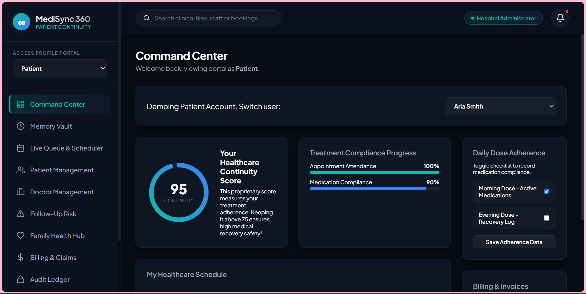
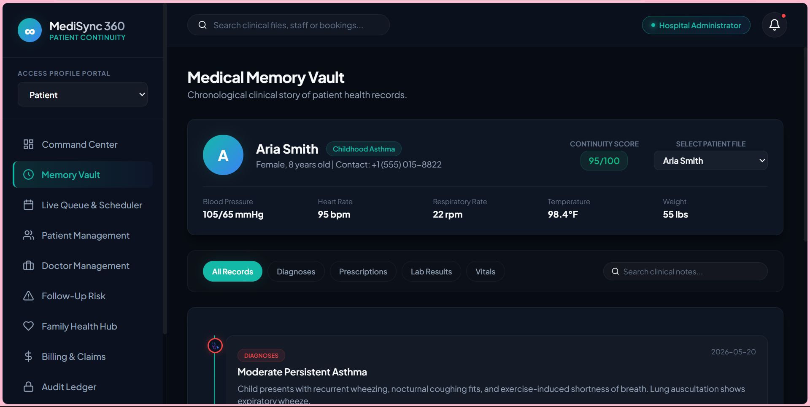
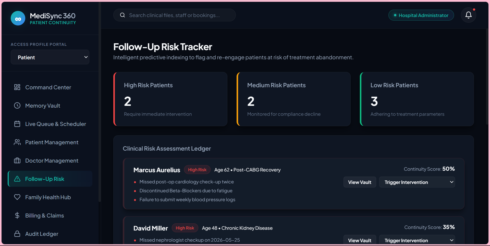
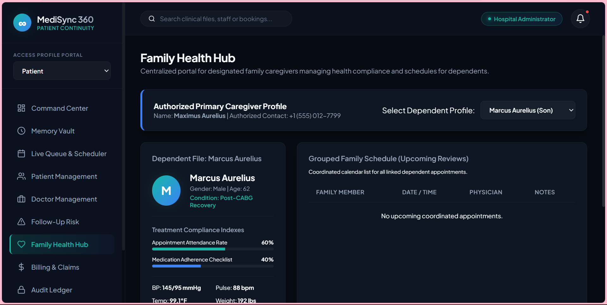
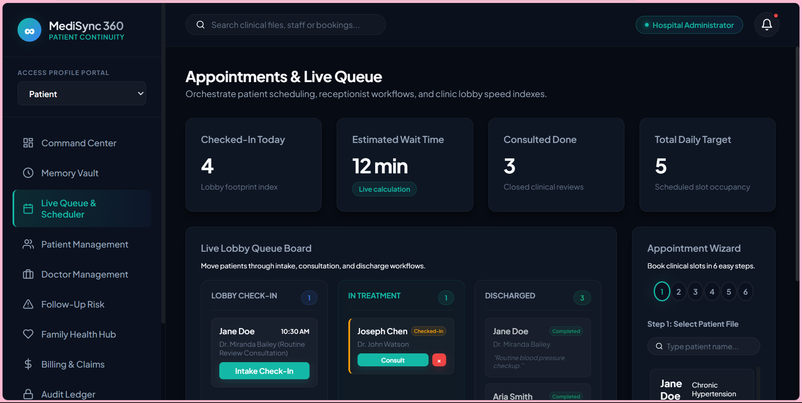
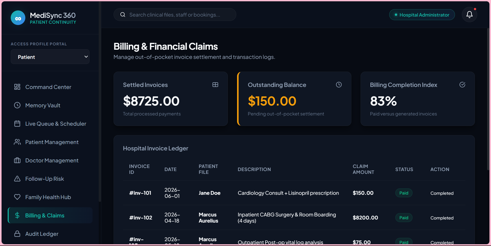

# MediSync 360

### Connecting Care Beyond Hospital Walls

<p align="center">


</p>

<p align="center">
A healthcare continuity and hospital operations platform designed to improve patient care coordination, operational efficiency, and long-term treatment management.
</p>

---

## Overview

MediSync 360 is a healthcare continuity and hospital operations platform that extends beyond traditional Hospital Management Systems.

The platform introduces continuity-focused healthcare management through:

* Medical Memory Vault
* Follow-Up Risk Tracking
* Healthcare Continuity Engine
* Family Health Hub
* Doctor Availability Monitoring
* Queue & Operations Management

---

## Live Demo

[View Live Demo](https://drive.google.com/file/d/1gzN1Ios653oxqluVJqu1_Fqs6gOuE4zy/view?usp=sharing)

---

## Problem Statement

Healthcare systems often struggle with:

* Fragmented patient records
* Missed follow-ups
* Poor care coordination
* Inefficient scheduling
* Limited visibility into patient risk levels

MediSync 360 addresses these challenges through a unified healthcare operations platform.

---

## Live Demo

https://medi-sync-360.vercel.app/

---

## Core Features

### Medical Memory Vault

Maintain a complete chronological patient history including:

* Diagnoses
* Prescriptions
* Consultation Notes
* Treatment Records
* Follow-Up Activities

### Healthcare Continuity Engine

Calculates a Continuity Score to help identify patients who may require additional attention and engagement.

### Follow-Up Risk Tracker

Tracks patients at risk based on:

* Missed Appointments
* Delayed Follow-Ups
* Continuity Trends

Supports proactive intervention planning.

### Doctor Availability Engine

Monitor doctor status:

* Available
* Consulting
* Surgery
* Emergency
* On Break
* Offline

Improves appointment planning and operational efficiency.

### Family Health Hub

Provides caregivers with a consolidated view of:

* Family Appointments
* Dependent Health Records
* Coordinated Care Schedules

### Smart Scheduling & Queue Management

Features include:

* Appointment Booking
* Queue Tracking
* Intake Management
* Wait-Time Forecasting

### Analytics Dashboard

Visual insights into:

* Patient Statistics
* Continuity Metrics
* Risk Distribution
* Operational Performance

### Audit & Compliance Ledger

Maintains transparent operational records and activity history.

---

## Supported Roles

| Role           | Access                  |
| -------------- | ----------------------- |
| Super Admin    | System Management       |
| Hospital Admin | Operational Oversight   |
| Doctor         | Patient Care Management |
| Nurse          | Clinical Support        |
| Receptionist   | Scheduling & Intake     |
| Patient        | Personal Records        |
| Caregiver      | Family Coordination     |

---

## System Architecture

```text
Patient Intake
      │
      ▼
Appointment Scheduling
      │
      ▼
Doctor Consultation
      │
      ▼
Medical Memory Vault
      │
      ▼
Continuity Engine
      │
      ▼
Risk Tracker
      │
      ▼
Analytics & Reporting
```

---

## Technology Stack

| Category     | Technology                    |
| ------------ | ----------------------------- |
| Frontend     | HTML5                         |
| Styling      | CSS3                          |
| Logic        | JavaScript ES6                |
| Architecture | Single Page Application (SPA) |
| Storage      | LocalStorage                  |
| UI Design    | Glassmorphism                 |

---

## Key Highlights

* Multi-Role Healthcare Platform
* Medical Memory Vault Concept
* Healthcare Continuity Scoring
* Follow-Up Risk Tracking
* Family Care Coordination
* Doctor Availability Monitoring
* Modular SPA Architecture
* Responsive Glassmorphism Interface

---

## Screenshots

<table>
<tr>
<td align="center"><b>Command Center</b></td>
<td align="center"><b>Medical Memory Vault</b></td>
</tr>
<tr>
<td></td>
<td></td>
</tr>

<tr>
<td align="center"><b>Follow-Up Risk Tracker</b></td>
<td align="center"><b>Family Health Hub</b></td>
</tr>
<tr>
<td></td>
<td></td>
</tr>

<tr>
<td align="center"><b>Live Queue Management</b></td>
<td align="center"><b>Billing Management</b></td>
</tr>
<tr>
<td></td>
<td></td>
</tr>
</table>

---

## Future Enhancements

* Authentication & Authorization
* PostgreSQL Integration
* REST API Services
* Real-Time Notifications
* Multi-Hospital Support
* Electronic Health Record Integrations

---

## Author

**Maryam Nibras**

MediSync 360 was developed as a healthcare technology project focused on improving patient continuity, operational efficiency, and coordinated care management.
